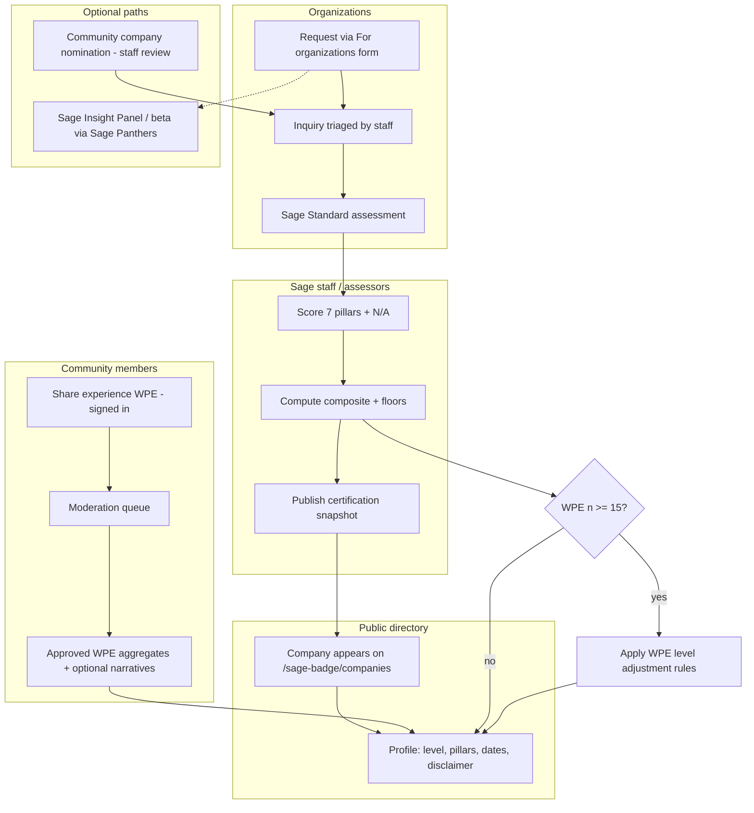

# Sage Badge: Mini Whitepaper (Process Summary)

| | |
|---|---|
| **Organization** | SageÉlan Foundation, Inc. (Sage With You program) |
| **Program** | Sage With You · Living in Place |
| **Charter version** | 1.0 (Phase 1) |
| **Document version** | 1.0 (process overview) |
| **Last updated** | June 2, 2026 |
| **Audience** | Owners, staff, partners, and reviewers preparing for UAT or public launch |

**Implementation status (v1.1):** see `SAGE_BADGE_PROGRAM_STATUS_WHITEPAPER_v1.1.md` and `SAGE_WITH_YOU_FULL_SITE_AUDIT.md`.

**Related repo docs:** `SAGE_BADGE_SCORING_CHARTER.md`, `SAGE_BADGE_PHASE1_DATA_MODEL.md`, `SAGE_BADGE_COMPANY_SUPPORT_AND_SAGE_PANTHERS.md`, `SAGE_BADGE_GO_LIVE.md`

**Export to PDF:** See [Section 12](#12-export-to-pdf). The Mermaid diagram in Section 6 is duplicated as a text flow for tools that do not render diagrams.

---

## 1. Purpose

The **Sage Badge** recognizes organizations that help people **age safely and confidently at home** (living in place). It is not a medical license, regulatory approval, or a generic “best company” award. It combines:

1. **The Sage Standard:** trained assessor scoring on seven evidence-informed pillars  
2. **What People Are Experiencing (WPE):** moderated, structured community feedback  

Together these produce a **Sage Verified** public designation when thresholds are met.

---

## 2. Core definitions

| Term | Meaning |
|------|---------|
| **Sage Badge** | The overall recognition program |
| **The Sage Standard** | Formal 7-pillar assessment (scores 1-5 per pillar) |
| **Sage Verified** | Public badge for companies at **Ready** level or above |
| **WPE** | Community experience submissions (ratings + optional narrative) |
| **Composite score** | Weighted average of applicable pillar scores (service type may adjust weights) |
| **Floor rules** | Minimum pillar scores required before any public badge |

---

## 3. The seven pillars

Each pillar is scored **1-5** by a trained Sage assessor using observable evidence:

1. Accessibility  
2. Safety & Environment  
3. Communication & Transparency  
4. Dignity & Autonomy  
5. Continuity of Support  
6. Caregiver Access & Supportability  
7. Technology & Ease of Use  

**N/A:** If a pillar truly does not apply (e.g. no digital product), it is marked N/A with written justification and **excluded** from the composite (not treated as a 5).

**Service-type weights (Phase 1):** Each company has one primary service type (home modification, DME, home health, insurance/benefits, FinTech/billing, telehealth, community/transport, legal/estate, or general). Selected pillars can carry **1.5× weight** in the composite; all seven are still scored and shown publicly.

---

## 4. Certification levels (from The Sage Standard)

| Level | Composite (typical) | Public Sage Verified badge? |
|-------|---------------------|----------------------------|
| **Limited** | 1.0 - 2.4 | No |
| **Emerging** | 2.5 - 3.2 | No |
| **Ready** | 3.3 - 3.9 | **Yes** |
| **Trusted** | 4.0 - 4.4 | **Yes** |
| **Exceptional** | 4.5 - 5.0 | **Yes** |

### Floor rules (mandatory)

A company **cannot** show a public Sage Verified badge if:

- Any applicable pillar is **≤ 2**, or  
- **Safety & Environment** is **≤ 3**, or  
- **Dignity & Autonomy** is **≤ 3**, or  
- The assessment is **older than 24 months** without renewal  

If the composite would qualify but a floor fails, the public view stays **Not Yet Sage Verified** (internally may cap at Emerging).

---

## 5. WPE (What People Are Experiencing)

WPE **does not replace** the Sage Standard. It can **adjust** the displayed level when enough moderated data exists.

### Per submission (signed-in community member)

- Overall experience (1-5)  
- Supports living in place: Yes / Somewhat / No  
- Caregiver access: Easy / Difficult / Not possible  
- Technology ease (1-5)  
- Optional barriers (controlled list) and narrative (staff-moderated before any public quote)

### Publication thresholds (aggregates on profile)

- ≥ **15** approved submissions in the last 24 months  
- ≥ **10** unique submitters  
- Recent activity within 24 months  

Below threshold: profile shows that community feedback is still being collected (no public aggregate numbers).

### WPE level adjustments (when thresholds met)

- **Ready → Trusted (community boost):** composite ≥ 3.3, WPE avg ≥ 4.2, ≥ 70% Yes/Somewhat on living in place, floors still pass  
- **Trusted → Exceptional:** composite ≥ 4.0, WPE avg ≥ 4.6, ≥ 85% Yes/Somewhat, ≥ 60% caregiver “Easy”  
- **Provisional status:** sustained low WPE (e.g. avg ≤ 3.0 for 6 months with enough n) can trigger review and relabeling while badge may remain visible with an “under review” style message; re-assessment within 90 days  

WPE generally **does not demote** below Ready while the Sage Standard still qualifies and floors pass (unless re-assessment fails).

---

## 6. End-to-end process (who does what)



**Text flow (for PDF / print when Mermaid is not rendered):**

```
Organizations → For organizations form → Staff triage → Sage Standard assessment
     → Score 7 pillars → Composite + floors → Publish snapshot
     → Public directory (/sage-badge/companies) → Company profile

Community (signed in) → Share experience (WPE) → Moderation → Approved aggregates → Profile

Optional: Community nomination → Staff review (same triage path)
Optional: Sage Insight Panel / beta (Sage Panthers) → Informs assessment, does not certify

After publish: If WPE approved count >= 15 → Apply WPE level adjustment rules → Profile
```

### A. Organizations (primary path)

1. Visit **For organizations** (`/sage-badge/for-companies`).  
2. Submit inquiry type: Sage Verified assessment, improvement pathway, Sage Panthers consulting, beta testing, or general.  
3. Staff triage (`badge_company_inquiries`), scope work (assessment, Insight Panel, beta cohort).  
4. Assessor runs **The Sage Standard**, records pillar scores, system computes composite and level.  
5. Staff **publish** assessment → certification snapshot → company status **published** in directory.  
6. Renewal: light review (~12 mo for Ready); full re-assessment (~24 mo for Trusted/Exceptional).

### B. Community (experience feedback)

1. Sign in.  
2. Choose a **published** Sage Verified company.  
3. Submit WPE via **Share your experience** (`/sage-badge/experience`).  
4. Staff **approve or reject** in Sage Badge admin.  
5. When thresholds are met, aggregates and selected narratives may appear on the company profile.

**Company not listed yet:** Staff may receive **community nominations** (`community_nomination` inquiry type). That form is not promoted in site footer or main navigation; it is reachable from in-context links (e.g. empty directory, “company not listed” on the experience flow). Nominations are intake for staff review, not instant listing.

### C. Sage staff (operations)

- Roles in `badge_staff_roles` (assessor, moderator, admin).  
- Admin: moderate WPE, view inquiries, publish UAT demo company for testing.  
- Writes to operational tables go through staff credentials or Edge Functions (service role); public users do not insert assessments directly.

### D. Sage Panthers (adjacent, not certifying)

**Sage Insight Panel** and **Living in Place Beta Cohort** deliver senior-informed feedback mapped to pillars. Panthers **inform**; they do **not** grant the badge. Certification remains assessor-led under the charter. See `SAGE_BADGE_COMPANY_SUPPORT_AND_SAGE_PANTHERS.md`.

---

## 7. What the public sees

On each **Sage Verified** company profile:

- Display name, service type, description  
- **Effective level** (Ready / Trusted / Exceptional, with WPE adjustment if applicable)  
- **Composite score** and **pillar scorecard** (7 pillars, N/A labeled)  
- Assessment / certification dates and next review due  
- WPE aggregates (only if n ≥ 15, etc.)  
- Disclaimer: not medical advice; not regulatory licensure  

Companies at Limited/Emerging or failing floors are **not** listed as verified in the public directory.

---

## 8. Phase 1 technology (Sage With You site)

| Piece | Role |
|-------|------|
| Supabase tables | Companies, assessments, pillar scores, snapshots, WPE, inquiries, staff roles |
| Migrations | `005_sage_badge_phase1.sql`, `005_badge_rls_repair.sql` (if needed), `006_community_company_nomination.sql` |
| Public views | `badge_companies_public`, `badge_wpe_aggregates_public` (no PII) |
| Edge Functions | `submit-badge-inquiry`, `submit-badge-wpe` |
| Frontend routes | `/sage-badge`, `/sage-badge/companies`, `/sage-badge/for-companies`, `/sage-badge/experience`, `/sage-badge/admin`, `/sage-badge/suggest-company` (in-context only) |

**Out of scope Phase 1:** company self-service portal, payments, embeddable badge CDN, automatic cross-link to Sage Panthers databases (email/routing only).

---

## 9. Governance and trust

- **Charter version** stored on each assessment (`1.0` today).  
- **Safety & Dignity floors** are locked for Phase 1.  
- **Pilot calibration:** first 5-10 companies may include blind dual scoring before locking weights.  
- **Legal (pre-public launch):** SOW templates, WPE moderation policy, privacy/terms updates, public disclaimers, conflict-of-interest rules for professionals submitting WPE.  

**Operations (locked in go-live checklist):**

| Item | Value |
|------|--------|
| Badge program inquiry mailbox | `SageWithYou@sageelan.org` |
| Edge SMTP identity | `info@sageelan.org` (Microsoft SMTP, same as contact form) |
| Company pricing model | Company-paid at launch |
| Pre-go-live site access | Staging password gate; full badge UX after unlock |

---

## 10. Elevator summary

The Sage Badge helps families and professionals find organizations that truly support **living in place**. Sage-trained assessors score each company on **seven pillars** with strict **safety and dignity floors**; only **Ready and above** earn **Sage Verified** listing. **Community experience (WPE)** adds moderated, structured feedback and can **raise** the displayed level when enough approved responses show strong real-world outcomes, or trigger **review** when feedback stays poor. Organizations enter through **For organizations**; the public browses the **verified directory** and signed-in members share experience after companies are published. Sage Panthers programs can prepare or enrich assessment but **do not replace** the Sage Standard.

---

## 11. Document history

| Version | Date | Notes |
|---------|------|-------|
| 1.0 | 2026-06-02 | Initial mini whitepaper aligned with Charter v1.0 and Phase 1 implementation |
| — | 2026-06-02 | Implementation status moved to `SAGE_BADGE_PROGRAM_STATUS_WHITEPAPER_v1.1.md` |

---

## 12. Export to PDF

**Source file (this document):** `docs/SAGE_BADGE_MINI_WHITEPAPER.md`

### Option A: VS Code / Cursor (recommended)

1. Open `SAGE_BADGE_MINI_WHITEPAPER.md`.
2. Install the **Markdown PDF** extension (yzane.markdown-pdf) if needed.
3. Command Palette → **Markdown PDF: Export (pdf)**.
4. Save as `SAGE_BADGE_MINI_WHITEPAPER.pdf` (same folder or your share drive).

### Option B: Pandoc (command line)

From the Sage With You project root:

```bash
pandoc docs/SAGE_BADGE_MINI_WHITEPAPER.md -o docs/SAGE_BADGE_MINI_WHITEPAPER.pdf --from gfm -V geometry:margin=1in
```

Install [Pandoc](https://pandoc.org/) if it is not already on your machine. Mermaid blocks are skipped unless you use a Mermaid filter; use the **text flow** in Section 6 for a complete printed diagram.

### Option C: GitHub or GitLab

Push the repo, open the file in the web UI, print the rendered page (browser **Print** → **Save as PDF**). Enable background graphics for table borders.

### Option D: Word then PDF

Open the `.md` in Microsoft Word (File → Open), adjust heading styles if needed, then **Save As** PDF.

**Tip:** For board packets, export the charter (`SAGE_BADGE_SCORING_CHARTER.md`) separately as the technical appendix; keep this file as the 2-3 page process overview.
